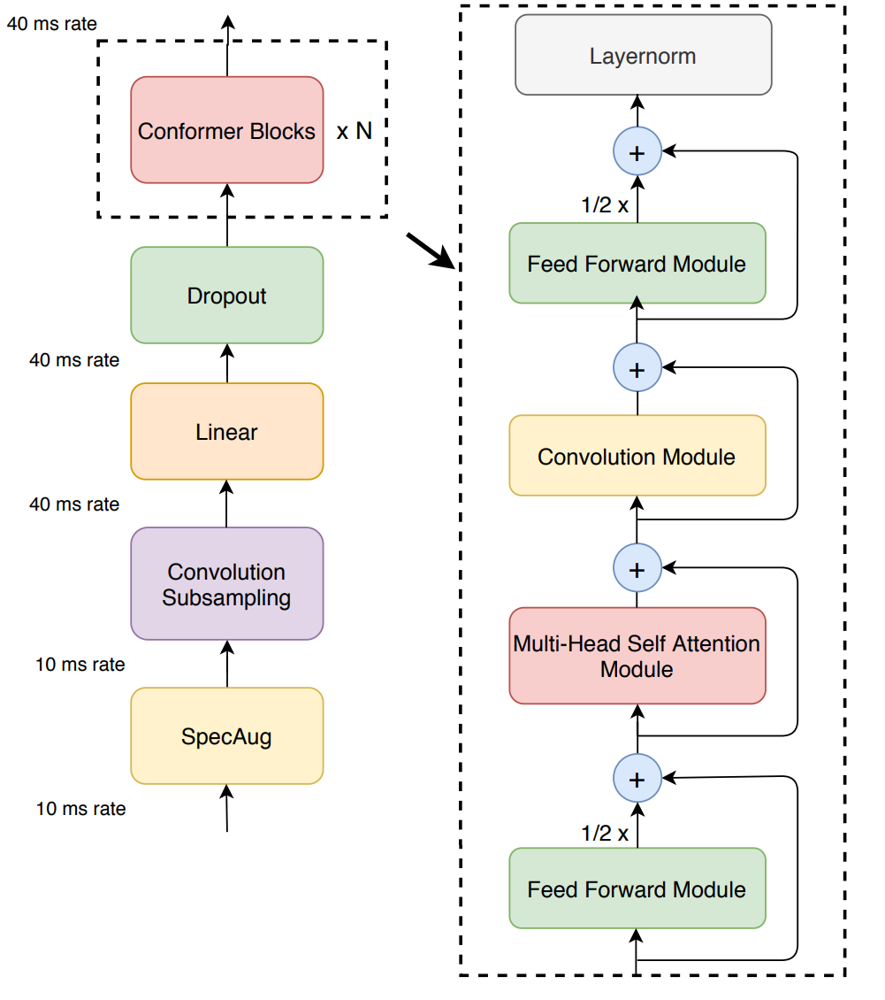

# BanglaASR
Bangla is the seventh most spoken language in the world, yet resources for automatic speech recognition (ASR) in Bangla are relatively scarce. To address this gap, we developed a robust ASR model using [NVIDIA's NeMo](https://github.com/NVIDIA/NeMo) framework. This model is designed to accurately transcribe spoken Bangla into text, which can be used in various applications like voice assistants, transcription services, and more.

This repository contains the code and the model. The model is trained on the Mozilla Common Voice Bangla dataset, leveraging the Fast Conformer architecture with a CTC loss function for efficient and accurate speech-to-text conversion in Bangla.

## Table of Contents
- [Introduction](#introduction)
- [Fast Conformer](#fast-conformer)
- [Dataset](#dataset)
- [Installation](#installation)
- [Training](#training)
- [Inference](#inference)
- [References](#references)

## Fast Conformer

The Fast Conformer architecture improves on the standard Conformer by optimizing for both speed and accuracy. It achieves this through a combination of convolutional layers and self-attention mechanisms, making it well-suited for speech recognition tasks where computational efficiency is critical.

Architecture of the encoder of Conformer-CTC:



The key benefits of the Fast Conformer model:
- **High accuracy**: Convolutional layers capture local dependencies, while self-attention layers handle global context, resulting in accurate transcriptions.
- **Efficient computation**: The architecture is optimized for both speed and memory efficiency, making it ideal for deployment on real-time ASR systems.
- **CTC Loss**: The model is trained using Connectionist Temporal Classification (CTC), a popular loss function for sequence prediction tasks where alignment between input and output sequences is unknown.

To know more, please check [the paper](https://arxiv.org/pdf/2305.05084)

## Dataset

The model is trained on the **Mozilla Common Voice Bangla dataset**, which contains approximately **1200 hours of Bangla speech data**. This dataset includes diverse speakers, dialects, and recording conditions, making it well-suited for building a robust ASR model.

The Mozilla Common Voice project is a crowd-sourced initiative that collects transcribed speech in multiple languages, including Bangla, to support the development of ASR models. You can download the dataset from [Mozilla Common Voice](https://commonvoice.mozilla.org/en/datasets).


## Installation
1. Create a conda environment as
```bash
conda create --name nemo_asr python==3.11
conda activate nemo_asr
```
2. Install dependencies
```bash
sudo apt-get update && apt-get install -y libsndfile1 ffmpeg
pip install Cython packaging
python -m pip install git+https://github.com/NVIDIA/NeMo.git@main#egg=nemo_toolkit[all]
```

## Training

- **Architecture**: Fast Conformer (CTC-based)
- **Framework**: NVIDIA NeMo
- **Dataset**: Mozilla Common Voice Bangla (1200 hours)
- **Training Steps**: 1000 epochs with a batch size of 32
- **Optimizations**: Mixed precision training with AMP (Automatic Mixed Precision)
- **Word Error Rate (WER)**: After 1000 epochs, the model achieved a WER of **4.12%**.

To train the model using NeMo, the following command can be used:

```bash
python train.py \
  --model-config-path ./configs/fast_conformer_ctc_bpe_bangla.yaml \
  --dataset-path ./datasets/bangla_common_voice \
  --num-gpus 4
```
## Inference
There are different variants of FastConformer-CTC-BPE, Among them we only trained the **Large** one.

| Model | d_model | n_layers | n_heads | Parameters | Bangla-only | Training Status |
| ------------- | ------------- | --------    |--------    | ------------- | ------------- | --------    |
Small   | 176  |16  | 4   | 14 M 	| X |  X
Medium   | 256 	|16  | 4 	|32 M 	| X	|  X
Large  | 512 |17  | 8 	|120 M 	| ✓ |  ✓ 
XLarge | 1024 |24 | 8 	|616 M 	| X |  X
XXLarge  | 1024 |42 | 8 	|1.2 B | X |  X

You can use the pre-trained model for inference with the following code snippet:
```py
import nemo.collections.asr as nemo_asr

# Load the pre-trained ASR model
asr_model = nemo_asr.models.ASRModel.from_pretrained("nahidbrur/fast_conformer_ctc_bangla")

# Transcribe an audio file
transcription = asr_model.transcribe(paths2audio_files=["./dataset/test/test_bangla.wav"])
print(f"Transcription: {transcription[0]}")
```

# Contribution
```
@misc{BanglaASR ,
  title={Fast Conformer Bangla ASR Model},
  author={Md Nurul Islam},
  howpublished={},
  year={2023}
}
```
# Reference
1. https://docs.nvidia.com/nemo-framework/user-guide/latest/nemotoolkit/asr/models.html#fast-conformer
